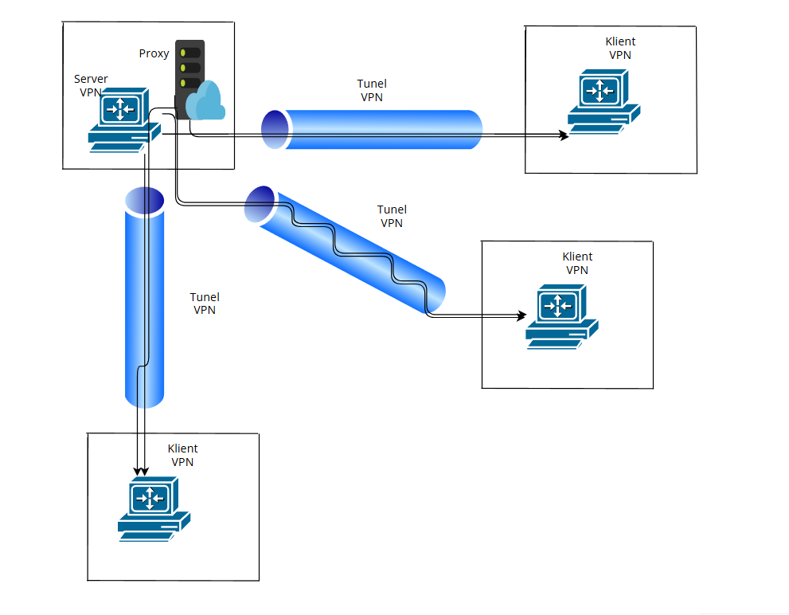

# VPN z autoryzacją, szyfrowaniem i warstwową kontrolą SOCKS5

## Opis projektu

Do projektu wykorzystano system operacyjny Debian 12.

W celu autoryzacji użytkowników, należy użyć jednego z użytkowników z pliku json, których hasło jest zahashowane.
- jakub : jakub123,
- admin: admin123,
- testuser: test123


Ten projekt implementuje **własny serwis VPN** oparty o interfejs TUN (`tun0`), który:

- szyfruje cały ruch IP (TCP, ICMP),
- autoryzuje użytkownika (login + hasło),
- bezpiecznie wymienia klucz AES (przez RSA),
- umożliwia **granularną kontrolę dostępu**:
  - na poziomie systemu (`server.py`)
  - na poziomie aplikacji (`socks5.py`)

## Architektura systemu



## Szyfrowanie i bezpieczeństwo

| Mechanizm | Opis |
|----------|------|
| **RSA (2048)** | Klient szyfruje losowy klucz AES publicznym kluczem serwera |
| **AES (256)** | Klucz sesyjny używany do szyfrowania wszystkich pakietów |
| **CFB mode** | AES działa na pełnych pakietach binarnych |
| **TUN (`/dev/net/tun`)** | Przechwytuje cały ruch IP między klientem a serwerem |
| **Logowanie użytkownika** | Login + hasło (plaintext lub hashowane) |
| **Filtr IP** | `server.py` filtruje pakiety IP po protokole i porcie |
| **SOCKS5 filtr** | `socks5.py` filtruje ruch aplikacyjny po portach TCP |

## Funkcje

| Moduł | Funkcja |
|-------|---------|
| `tun.py` | Obsługa TUN: czytanie/pisanie pakietów IP |
| `aes.py` | Szyfrowanie i deszyfrowanie pakietów |
| `rsa_gen.py` | Generacja i załadowanie kluczy RSA (`public.pem`, `private.pem`) |
| `users.py` | Logowanie użytkownika z pliku `users.json` |
| `server.py` | Serwer VPN: autoryzacja, wymiana klucza, filtrowanie IP |
| `client.py` | Klient VPN: logowanie, wymiana klucza, ruch tunelowany |
| `socks5.py` | Opcjonalny SOCKS5 proxy działający przez `tun0`, z ALLOWED_PORTS |

## Uwierzytelnianie

- Lista użytkowników w pliku `users.json`
- Obsługa login:hasło (plaintext lub SHA256)

## Wymiana klucza AES

1. Klient generuje `os.urandom(32)` – klucz AES
2. Szyfruje go RSA publicznym kluczem serwera (`public.pem`)
3. Serwer deszyfruje `private.pem`

## Filtrowanie pakietów IP (`server.py`)

- TCP porty: `80`, `3306`
- ICMP (ping)
- Blokowane: inne TCP, UDP, SSH, DNS, FTP itd.

## SOCKS5 proxy (`socks5.py`)

- Port: `1080` (na `100.20.10.1`)
- Filtrowanie portów: np. tylko `3306`


## Testy

```
ping 100.20.10.1                   # ICMP ✔️
curl http://100.20.10.1           # TCP:80 ✔️
mysql -h 100.20.10.1 -u user -p   # TCP:3306 ✔️
ssh 100.20.10.1                   # ❌ (port 22 zablokowany)
curl --socks5-hostname 100.20.10.1:1080 http://100.20.10.1   # ❌ jeśli port 80 zablokowany
mysql --protocol=TCP --proxy=socks5://100.20.10.1:1080 ...   # ✔️ jeśli 3306 dozwolony

```

## Uruchomienie

```
# Serwer VPN (serwer)
sudo python3 server.py

# SOCKS5 (serwer)
sudo python3 socks5.py

# Klient (serwer)
sudo python3 client.py
```

## Zalety

- Pełne szyfrowanie (AES + RSA)
- TUN z kontrolą IP
- SOCKS5 proxy z filtrowaniem portów

## Dodatowe implementacja i zabezpieczenia
- Impementacja systemu w kontenery
- Impementacja bazy danych do przechowywania informacji o użytkownikach
- Monitoring systemu, zbieranie logów 
- Wrożenie limitu prób logowania w określonym czasie
- Whitelist / Blocklist w celu eliminiacji logowania z nieautoryzowanych adresów
- Określenie długości sesji i prośba o ponowną autentykacje użytkowników
- Generowanie nowych kluczy AES w trakcji sesji
- Dodatkowe logowanie na wartstwie SOCKS5
- opcjonalnie implementacja GUI
